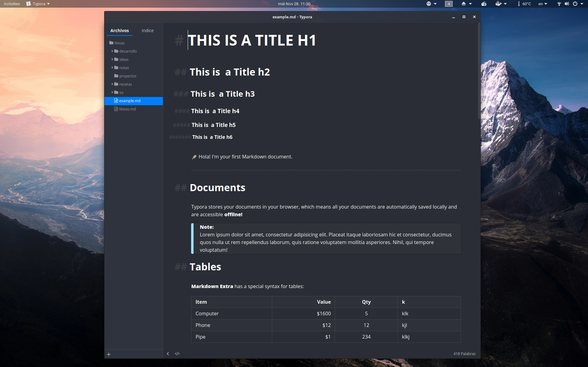
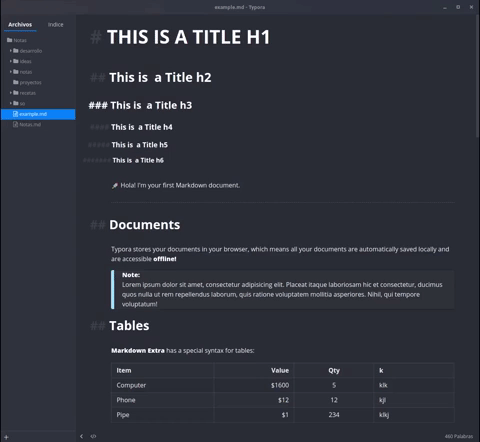
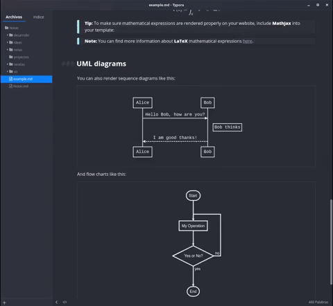
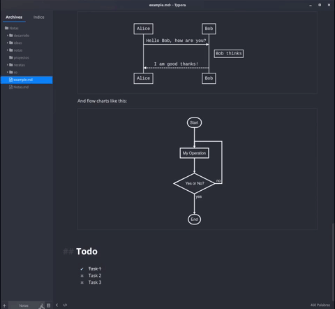

# PLANE-TYPORA THEME

A beautiful theme for Typora, more information in [Plane project](https://github.com/wfpaisa/plane).

 

## Install
1. Download `plane-dark.css` in `~/.config/Typora/themes`.
2. Open: Typora -> Themes | choose: Plane dark.

## License

[MIT License](./LICENSE)
